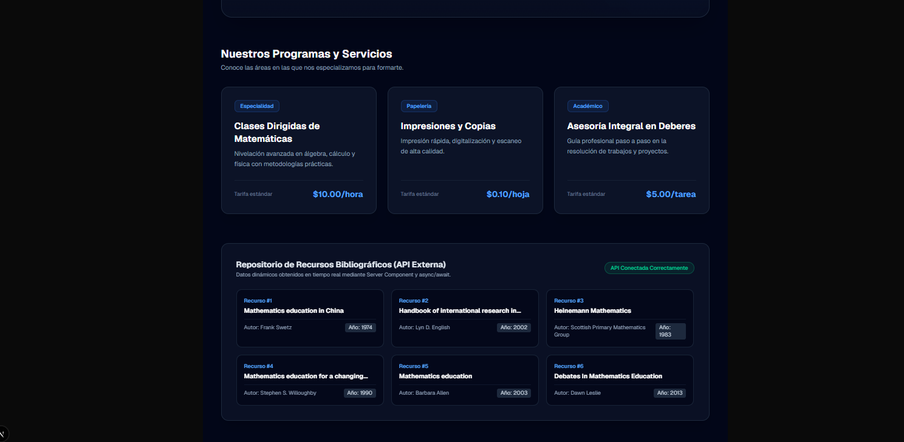
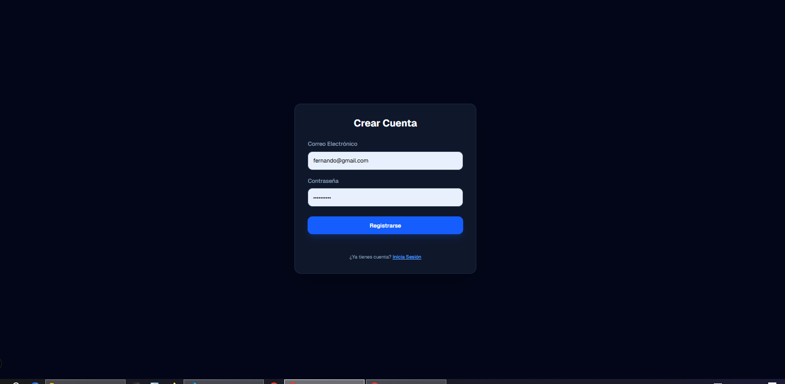
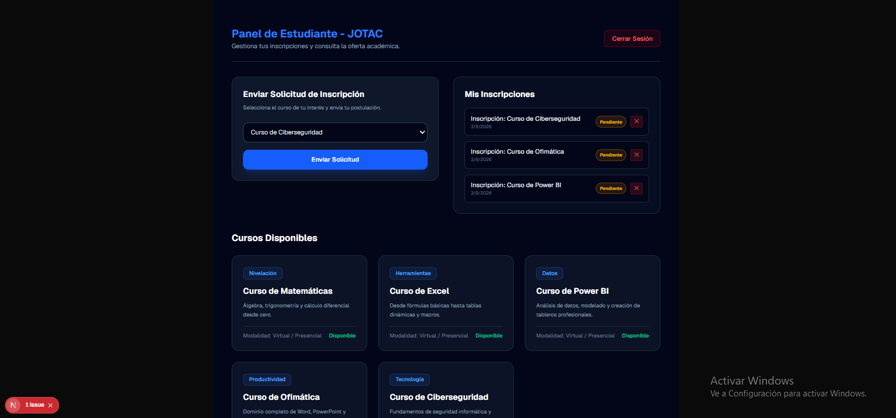

# JOTAC - Centro Académico y Plataforma Web

JOTAC es una plataforma web para la gestión de un centro académico. Permite consultar cursos y recursos bibliográficos, registrarse, iniciar sesión y enviar solicitudes de inscripción.

## Capturas de pantalla







## Stack tecnológico

* Next.js 14 (App Router)
* TypeScript / JavaScript
* Tailwind CSS
* Supabase (PostgreSQL + Auth)
* Git y GitHub
* Vercel

## Roles de usuario

* **Estudiante / Usuario general:** Puede registrarse, iniciar sesión, consultar cursos y recursos bibliográficos y enviar solicitudes de inscripción.

## Modelo de datos

La aplicación utiliza **Supabase PostgreSQL** para la gestión de los datos y **Supabase Auth** para la autenticación de usuarios.

La tabla principal de usuarios es `auth.users`, administrada por Supabase.

## Instalación local

```bash
git clone https://github.com/joeliga/jotace-app.git
cd jotace-app
npm install
npm run dev
```

Abrir en el navegador:

http://localhost:3000

## Variables de entorno

Crear un archivo `.env.local` en la raíz del proyecto:

```env
NEXT_PUBLIC_SUPABASE_URL=tu_url_de_supabase
NEXT_PUBLIC_SUPABASE_ANON_KEY=tu_clave_de_supabase
```

No se deben publicar los valores reales de estas variables.

## Credenciales de prueba

* **Usuario:** [docente_prueba@jotac.com](mailto:docente_prueba@jotac.com)
* **Contraseña:** Password123*

## Funcionalidades

* [x] Página principal
* [x] Consumo de API externa
* [x] Registro e inicio de sesión
* [x] Autenticación con Supabase
* [x] Protección de rutas privadas
* [x] Dashboard de estudiante
* [x] Consulta de cursos
* [x] Solicitud de inscripción
* [x] Recursos bibliográficos
* [x] Diseño responsive
* [x] Despliegue en Vercel

## Autor

**Joel Coro**

GitHub: https://github.com/joeliga


Proyecto desplegado y actualizado exitosamente.